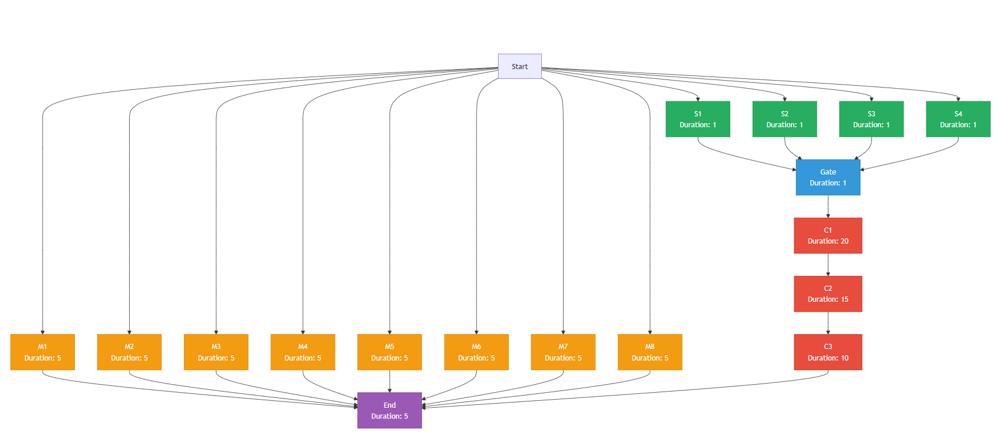

# Workflow Executor for LLM DAG Scheduling

## Problem Context

Modern AI applications often require multiple LLM calls to generate a single user response. A chatbot might need to:
1. Extract entities from user input
2. Query multiple knowledge bases
3. Generate responses for each query
4. Synthesize results into a final answer

These tasks form dependency graphs - some can run in parallel, others must wait for prerequisites. Running them sequentially wastes time. If task A takes 10 seconds and task B takes 8 seconds, running them in parallel completes in 10 seconds instead of 18.

The challenge: given arbitrary task graphs with unknown execution times, minimize total completion time.

## Implementation Strategies

### Unlimited Concurrency (External APIs)
Code: `orchestrators/unlimited_concurrency.py`

When using external APIs like OpenAI or Anthropic, the bottleneck is typically network latency and API response time, not local compute. We assume:
- API providers handle load balancing
- We can make arbitrary concurrent requests (within rate limits)
- Task completion order is unpredictable

The implementation maintains:
- Active task set: currently executing API calls
- Dependency tracking: which tasks are waiting for which completions
- Ready queue: tasks whose dependencies are satisfied

When any task completes, we immediately check its dependents. If all of a dependent's prerequisites are now complete, we launch it. Dictionary structures provide O(1) lookups for dependency checking, minimizing overhead between task completions.

This approach guarantees completion in critical path time - the longest chain of dependent tasks. No scheduling algorithm can do better when resources are unlimited.

### Limited Concurrency (Hosted LLMs)
Code: `orchestrators/limited_concurrency.py`

Self-hosted LLMs present different constraints:
- Fixed number of GPU workers
- Predictable throughput
- Need to choose which ready tasks to run when workers are scarce

This becomes the classic multiprocessor scheduling problem, which is NP-hard. Even with perfect knowledge of task durations, finding the optimal schedule requires exploring exponentially many possibilities.

We implement a critical-path heuristic (pseudocode in `pseudocode/critical_path_basic.txt`):

1. **Priority Calculation**: For each task, compute the longest path from that task to any end node. This represents how much the task could delay overall completion.

2. **Greedy Assignment**: When a worker becomes free, assign the highest-priority ready task.

This heuristic works well because tasks on the critical path directly determine minimum completion time. Delaying them delays everything. The algorithm runs in O(V + E) time for V tasks and E dependencies.

An advanced version (`pseudocode/critical_path_advanced.txt`, not implemented) also considers load balancing - sometimes running a slightly lower priority task maintains better worker utilization.

**Handling Unknown Durations at Runtime:**
When task durations are unknown at design time, the algorithm assigns each task an expected duration of 1 time unit. This default ensures:
- All tasks start with equal priority (modified by their position in the dependency graph)
- The algorithm still prioritizes tasks with more dependents
- Critical path calculations remain meaningful, just less accurate

As tasks execute, we update our estimates. After each run, we recalculate expected durations based on historical data. A task that consistently takes 10 seconds will have its estimate updated from 1 to 10, improving future scheduling decisions. This adaptive approach means the scheduler improves with use - initial runs may be suboptimal, but performance converges toward the theoretical optimum as duration estimates become accurate.

## Concrete Example: 4-Worker Scheduling



Consider this DAG with 4 available workers:

**Task Structure:**
- Start spawns 12 independent tasks:
  - S1-S4: Quick tasks (1 time unit each)
  - M1-M8: Medium tasks (5 time units each)
- Gate task: Requires all S tasks to complete (1 time unit)
- Critical chain: Gate → C1(20) → C2(15) → C3(10) → End(5)
- Total tasks: 17

**Sequential/Naive Execution:**
A breadth-first approach might process tasks alphabetically or by arrival order:
1. Time 0-5: Run M1-M4 on the 4 workers
2. Time 5-10: Run M5-M8
3. Time 10-11: Run S1-S4
4. Time 11-12: Run Gate
5. Time 12-62: Run critical chain

Total time: 62 units

The naive algorithm fails because it doesn't recognize that S1-S4 unlock the longest execution path. While workers process medium tasks, the critical path sits idle.

**Optimal Algorithm Execution:**
The critical-path algorithm computes priorities:
- S1-S4: Priority 52 (lead to 51-unit critical chain)
- M1-M8: Priority 5 (terminal tasks)

Execution:
1. Time 0-1: Run S1-S4 immediately
2. Time 1-2: Run Gate
3. Time 2+: Start critical chain while using spare workers for M tasks

Total time: 52 units (matches theoretical minimum)

Theoretical Speedup: 10 units (19%)

## Assumptions and Limitations

Our current implementation assumes:
1. **Known task durations**: We have estimates for how long each LLM call will take
2. **Deterministic execution**: Tasks take their expected time
3. **No failures**: All API calls succeed
4. **Static graph**: Dependencies don't change during execution

Real-world violations of these assumptions create challenges.

## Handling Unknown Durations

Task duration uncertainty comes from several sources:
- Prompt length doesn't predict response length
- Model load varies throughout the day
- Network latency fluctuates
- Some prompts trigger longer reasoning chains

Without duration estimates, we fall back to simpler heuristics:
- Level-based scheduling (process all depth-1 tasks first)
- Longest path by task count
- Random selection among ready tasks

The scheduler starts with default estimates but improves through experience, eventually building accurate duration models for better scheduling decisions.

## Performance Bottleneck Identification

The current implementation does not collect detailed performance metrics, but a production system would track:
- Task wait time (how long ready tasks waited for workers)
- Worker utilization (percentage of time workers were busy)
- Critical path participation (which tasks actually determined completion time)
- Dependency fan-out (tasks creating bottlenecks by blocking many dependents)

These metrics would help users restructure their DAGs. If a task with many dependents consistently runs late, users could split it or move parts earlier in the pipeline.

## Next Improvements

The primary enhancement would address execution time variance. Even with known average durations, real-world task times vary:
- A summarization task might take 2-8 seconds depending on input length
- API latency fluctuates with provider load
- Some prompts trigger more complex reasoning chains


With sufficient data, we could:
1. Calculate not just mean duration but variance for each task type
2. Use confidence intervals in scheduling (e.g., 90% chance task completes within 5 seconds)
3. Apply stochastic scheduling algorithms that optimize for expected completion time
4. Identify tasks with high variance as candidates for splitting or caching
5. Detect patterns (certain tasks slower at specific times, correlation between tasks)

A robust scheduler would use these statistics to make probabilistic decisions. This moves from deterministic scheduling toward stochastic optimization, better matching real-world behavior.
## Demo: test_demo.py Showcase

The `test_demo.py` script builds the example DAG and runs it with several
scheduling strategies. Running the script prints the DAG structure and a
performance comparison of sequential versus parallel execution.

```bash
python3 test_demo.py
```

Sample output:

```
Creating example DAG...

=== DAG Structure ===
Total tasks: 17

Short tasks (1s each): S1, S2, S3, S4
Medium tasks (5s each): M1, M2, M3, M4, M5, M6, M7, M8
Critical path: Gate → C1 → C2 → C3 → End

Theoretical minimum time (critical path): 51.0s
Sequential worst case: ~95.0s

==================================================
Testing: Sequential_Execution_1_Worker
==================================================
Workers: 1

Execution time: 95.14 seconds
Completed tasks: 17/17
Critical path identified: S1 → Gate → C1 → C2 → C3 → End
Critical path length: 52.0s

Worker utilization:
  worker_0_utilization: 100.0%

==================================================
Testing: Sequential_Execution_4_Workers
==================================================
Workers: 4

Execution time: 72.08 seconds
Completed tasks: 17/17
Critical path identified: S1 → Gate → C1 → C2 → C3 → End
Critical path length: 52.0s

Worker utilization:
  worker_0_utilization: 100.0%
  worker_1_utilization: 86.1%
  worker_2_utilization: 86.1%
  worker_3_utilization: 86.1%

==================================================
Testing: Optimized_Execution_4_Workers
==================================================
Workers: 4

Execution time: 52.48 seconds
Completed tasks: 17/17
Critical path identified: S1 → Gate → C1 → C2 → C3 → End
Critical path length: 52.0s

Worker utilization:
  worker_0_utilization: 99.2%
  worker_1_utilization: 30.6%
  worker_2_utilization: 30.6%
  worker_3_utilization: 21.0%

==================================================
Testing: Parallel_Execution_Unlimited_Workers
==================================================
Workers: Unlimited

Execution time: 52.04 seconds
Completed tasks: 17/17
Critical path identified: S1 → Gate → C1 → C2 → C3 → End
Critical path length: 52.0s

==================================================
PERFORMANCE COMPARISON
==================================================

Sequential_Execution_1_Worker:
  Time: 95.14s

Sequential_Execution_4_Workers:
  Time: 72.08s
  Speedup: 32.0% faster than sequential

Optimized_Execution_4_Workers:
  Time: 52.48s
  Speedup: 81.3% faster than sequential

Parallel_Execution_Unlimited_Workers:
  Time: 52.04s
  Speedup: 82.8% faster than sequential

Detailed results saved to: logs/demo_results.json

==================================================
KEY INSIGHTS
==================================================

1. Sequential execution processes tasks in order without considering
   dependencies, leading to delayed critical path execution.

2. Optimized execution with critical path prioritization ensures
   the longest chain of tasks starts as early as possible.

3. With 4 workers, we achieve near-optimal performance despite
   limited resources by intelligent task prioritization.

4. Unlimited concurrency achieves theoretical minimum time
   (critical path length) when API rate limits aren't a factor.
```
